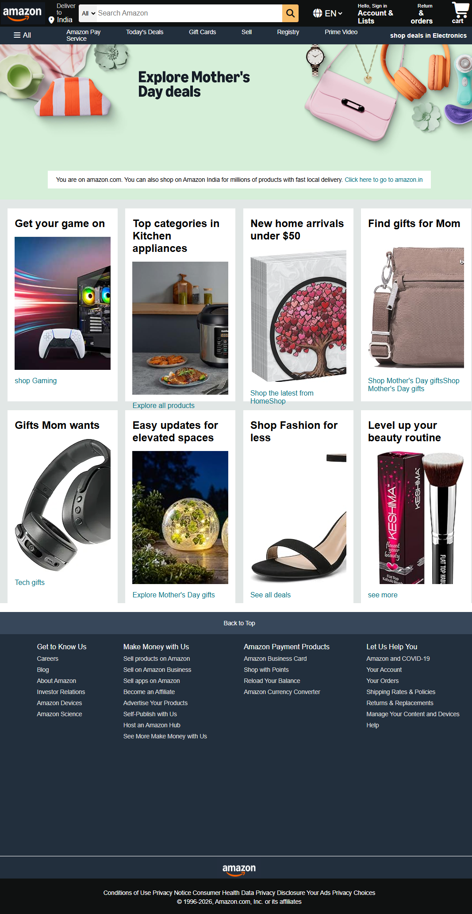

# 🛒 Amazon Clone Website

# 📌 Project Description

This project is a basic clone of the Amazon homepage created using HTML and CSS.
It is designed to practice front-end development skills and understand website layout structure.

# 🚀 Features

* Navigation bar with logo, search box, language, account, and cart
* Panel section with multiple options (Amazon Pay, Deals, etc.)
* Hero section with message banner
* Product section with different categories
* Footer section with multiple links

# 🛠️ Technologies Used

* HTML5
* CSS3
* Font Awesome (for icons)

# 🎯 Purpose

The main purpose of this project is to improve my web development skills as a beginner and understand how real websites are structured.

# 📷 Output

# 🔗 Live Demo

 https://dhruvi-patel15.github.io/clone-webpage/
 
# 👩‍💻 Author
    patel Dhruvi 
